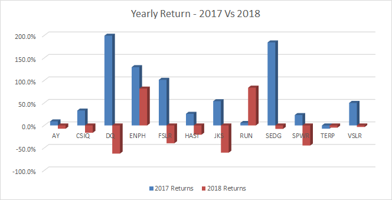
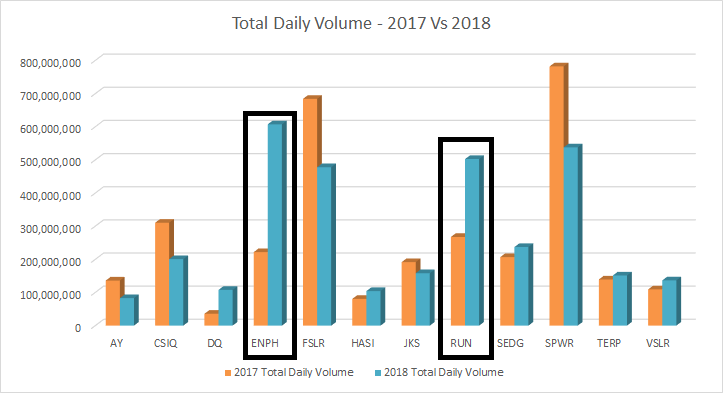
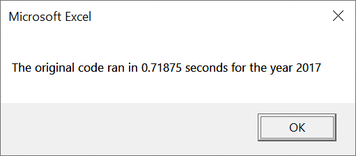
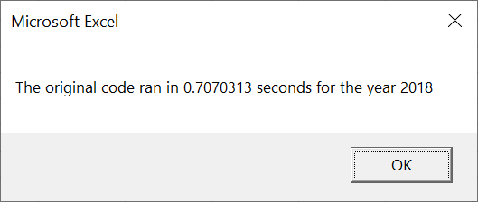
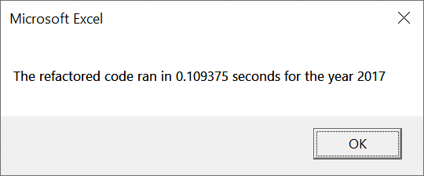
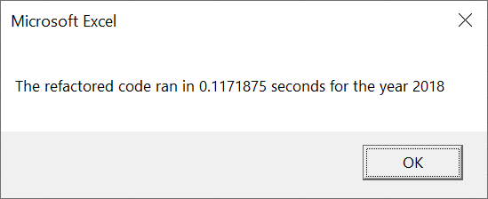

# Stock Analysis with VBA

## Overview of Project
Steve's parents are looking to invest in a Green Energy stock. They have picked out DAQ O(Ticker:DQ) but would like Steve to do some analysis and see if their choice is right. 
So Steve got hold of Green Energy stocks trading information for the year 2017 and 2018 for his analysis and asked for our help.
Since the data runs in thousands, we built VBA script to analyze stocks data. We also did some VBA code refactoring to speed up the processing time to generate analysis data.

### Purpose
The purpose of this project is two fold: 

1. Analyze and give recommendations to Steve and his parents on how the Green Energy stocks performed in Year 2017 and 2018
2. Analyze and summarize if and how the refactoring of VBA code helped speed the processing time.
 
## Results

### Stocks Analysis and Recommendation

Let's look at how the stocks performed in 2017 and 2018. The two data points we are looking are **Total Daily Volumes** and **Returns** for each year.

From the figure below, we see that while most of the stocks gave positive returns in 2017, only two stocks ENPH and RUN gave positive returns in 2018.

Now, let's look at how these two stocks performed in total daily volumes. We see that ENPH traded on much higher volume and gave positive returns for both years.

**Hence, our recommendation for Steve's parents would be to invest in ENPH**

### Code Analysis
Before we analyze the code, let's look at the time it took to run the stocks analysis for each year with and without refactored code.

**Time taken for analysis with original code**
                  

**Time taken for analysis with refactored code**
                  

**<em>So, it is clear that almost .6 seconds were saved with refactored code.</em>** 

The code review reveals that the variable declarations were pretty much similar. The difference in the code comes in how we are accessing the input sheets ("2017" and "2018") and the output sheet ("All Stocks Analysis").

The original script for accessing input and output sheets goes like this:

    '4) Loop through tickers
    For i = 0 To 11
        Ticker = tickers(i)
        totalVolume = 0
        Worksheets(yearValue).Activate
        '5) loop through rows in the data
        For j = 2 To RowCount
        'RowCount
            '5a) Get total volume for current ticker
            
            If Cells(j, 1).Value = Ticker Then
                totalVolume = totalVolume + Cells(j, 8).Value
                
            End If
            
            '5b) get starting price for current ticker
            If Cells(j - 1, 1).Value <> Ticker And Cells(j, 1).Value = Ticker Then
                startingPrice = Cells(j, 6).Value
            End If
            
            '5c) get ending price for current ticker
            If Cells(j + 1, 1).Value <> Ticker And Cells(j, 1).Value = Ticker Then
                endingPrice = Cells(j, 6).Value
            End If
        Next j
        '6) Output data for current ticker
        Worksheets("All Stocks Analysis").Activate
        Cells(4 + i, 1).Value = Ticker
        Cells(4 + i, 2).Value = totalVolume
        If totalVolume = 0 Then
            Cells(4 + i, 3).Value = "Error"
        End If
        If totalVolume <> 0 Then
        
            returnVal = endingPrice / startingPrice - 1
            Cells(4 + i, 3).Value = returnVal
            
            If returnVal > 0 Then

                'Color the cell green
                Cells(4 + i, 3).Interior.Color = vbGreen

            ElseIf returnVal < 0 Then

                'Color the cell red
                Cells(4 + i, 3).Interior.Color = vbRed
            Else

                'Clear the cell color
                Cells(4 + i, 3).Interior.Color = xlNone

            End If
        End If
    Next i

The first for, in step 4, loops through the 12 ticker symbols and the second for, in step 5, loops through all the rows in the input sheet, i.e. 3012. So the total times the code loops thorugh is **36144**.
This is done so that we can read the input year sheet and then write the output in the "All Stock Analysis" sheet within the outer loop. 

Now, lets's look at the refactored code.

    '2b) loop over all the rows
    For i = 2 To RowCount
    
    
        Ticker = tickers(tickerIndex)
        '3a) Increase volume for current ticker
        If Cells(i, 1).Value = Ticker Then
            tickerVolumes(tickerIndex) = tickerVolumes(tickerIndex) + Cells(i, 8)
        End If
        
        
        '3b) Check if the current row is the first row with the selected tickerIndex.
        'If  Then
       
        If Cells(i - 1, 1).Value <> Ticker And Cells(i, 1).Value = Ticker Then
            tickerStartingPrices(tickerIndex) = Cells(i, 6).Value
        End If
            
            
        'End If
        
        '3c) check if the current row is the last row with the selected ticker
        'If  Then
        If Cells(i + 1, 1).Value <> Ticker And Cells(i, 1).Value = Ticker Then
            tickerEndingPrices(tickerIndex) = Cells(i, 6).Value
        
            '3d Increase the tickerIndex to move to next ticker
            tickerIndex = tickerIndex + 1
        End If
        'End If
    
    Next i
    
    'Bring the All Stocks Analysis worksheet in view to write output
    Worksheets("All Stocks Analysis").Activate
    
    '4) Loop through your arrays to output the Ticker, Total Daily Volume, and Return.
    
    For i = 0 To 11
        Cells(4 + i, 1).Value = tickers(i)
        Cells(4 + i, 2).Value = tickerVolumes(i)
        Cells(4 + i, 3).Value = tickerEndingPrices(i) / tickerStartingPrices(i) - 1
    Next i
    
    'Formatting
    Worksheets("All Stocks Analysis").Activate
    Range("A3:C3").Font.FontStyle = "Bold"
    Range("A3:C3").Borders(xlEdgeBottom).LineStyle = xlContinuous
    Range("B4:B15").NumberFormat = "#,##0"
    Range("C4:C15").NumberFormat = "0.0%"
    Columns("B").AutoFit

    dataRowStart = 4
    dataRowEnd = 15

    For i = dataRowStart To dataRowEnd
        
        If Cells(i, 3) > 0 Then
            
            Cells(i, 3).Interior.Color = vbGreen
            
        Else
        
            Cells(i, 3).Interior.Color = vbRed
            
        End If
        
    Next i

In code refactor, we had separated the 2 loops. The first one will be to loop through the input sheet, i.e, 3012 times. In this loop we will gather the total daily volumes and returns for each stock in separate arrays.
We will then loop through the stocks and their daily volumes and returns 12 times to write them in output sheet. 

With the refactored code the total number of loop throughs are **3012+12=3024.** which is considerably lower than **36144** using the original code.

We should note that, there is some additional memory consumption with the refactored code since we are using 3 additional arrays to hold total daily volumes, starting and ending prices for each ticker. 
Given that nowadays computer memory is not a constraint, the faster time to get the output is worth sacrificing some additional memory.
 

## Summary

### Pros and Cons of Refactoring in general

| Pros         |      Cons      |
| :---:        |      :---:     |
| Provides flexibility to developer write the code first to deliver the functionality quicker and then come back to the code with refactoring to improve code quality or performance       |Sometimes developers can sacrifice code simplicity in order to gain slight performance improvement   |
| Refactoring also allows developers to simplify their code in subsequent iterations making it more manageable and extensible.       |Sometimes developers can spend too much time in code refactoring without substantial gain in code simplicity or performance improvement   |

### Pros and Cons of Refactoring in VBA code for stock analysis

| Pros         |      Cons      |
| :---:        |      :---:     |
| Separating the nested loop into two loops reduced the processing time. The processing time savings will expotentially increase as we add more stocks to the analysis.       |Some additional array variables like TickerVolumes, starting price and ending price etc had to be defined in order to avoid nested loop. This increases the memory usage for running the code.|
|         |Number of lines increased in the refactored version thus increasing maintainability of the code.|

